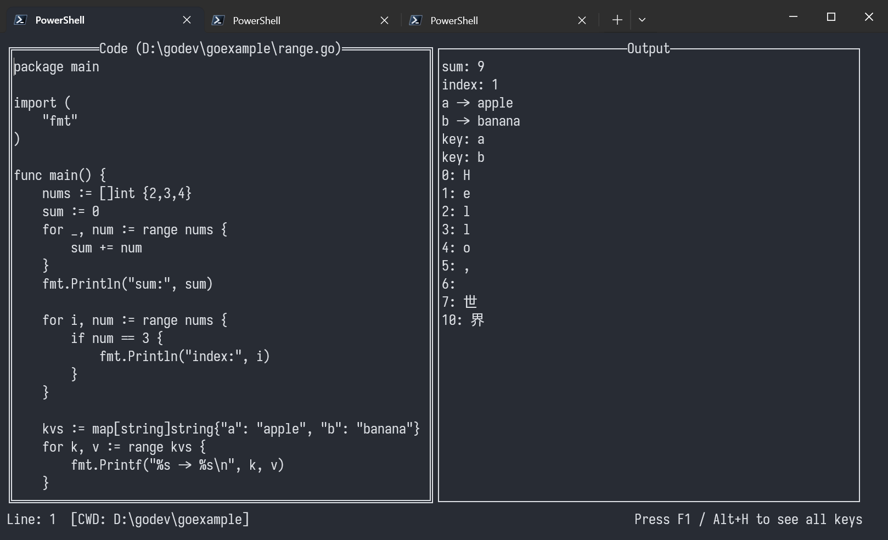

# GoPlay CLI

[中文文档](README_CN.md)

**GoPlay CLI** is a terminal-based Go Playground that allows you to write, format, compile, and run Go code directly from your command line interface. It features a clean, split-pane TUI (Text User Interface) built with [tview](https://github.com/rivo/tview), offering a seamless coding experience without leaving your terminal.


## Features

*   **Split-Pane Interface**: Edit code on the left, view output on the right.
*   **Instant Execution**: Run (`go run`) or Compile (`go build`) your code with a single keystroke.
*   **File Management**: Open, Save, and Create new files easily.
*   **Template Support**: Quickly load a predefined `.template` file or use the built-in default to bootstrap your coding.
*   **Build Support**: Compile your code into a standalone executable (`Ctrl+b`).
*   **System Clipboard**: Seamless Copy/Paste support with the system clipboard.
*   **Editor Tools**:
    *   Auto-formatting using `go fmt`.
    *   Snapshot-based Undo/Redo.
    *   Real-time cursor line tracking.
    *   Modification status indicators.
*   **Built-in Help**: Access a quick reference of all shortcuts anytime (`F1` or `Alt+h`).

## Installation

### Prerequisites
*   [Go](https://go.dev/dl/) installed on your system.

### Build from Source

1.  Clone the repository:
    ```bash
    git clone https://github.com/yourusername/goplay.git
    cd goplay
    ```

2.  Build the application:
    ```bash
    go build -o goplay
    ```

3.  Run it:
    ```bash
    ./goplay
    ```

## Usage

### Command Line Arguments

You can start GoPlay in different ways:

```bash
# Start with empty editor
./goplay

# Open a specific file
./goplay main.go

# Open a directory (sets it as working directory)
./goplay /path/to/project

# Open current directory
./goplay .
```

### Key Bindings

| Shortcut | Action | Description |
| :--- | :--- | :--- |
| **F1** | Help | Shows the shortcuts popup. |
| **F2** | Shrink Window | Decreases the left editor window width. |
| **F3** | Grow Window | Increases the left editor window width. |
| **F4** / **Ctrl+T** | Template | Loads template (Custom `.template` or Default). |
| **F5** / **Ctrl+R** | Run | Runs the current code and shows output. |
| **F6** / **Ctrl+K** | Compile Check | Compiles the code to check for errors (no binary output). |
| **F7** / **Ctrl+B** | Build Binary | Builds the code into a standalone executable. |
| **F9** / **Ctrl+P** | Settings | Opens settings (Working Directory). |
| **F10** | About | Shows about dialog. |
| **F12** / **Ctrl+Q** | Quit | Exits the application. |
| **Ctrl+F** | Format | Formats the code using `go fmt`. |
| **Ctrl+S** | Save | Saves the current code to a file. |
| **Ctrl+O** | Open | Opens an existing file. |
| **Ctrl+N** | New | Clears the editor for a new file. |
| **Ctrl+L** | Clear | Clears the editor content. |
| **Ctrl+Z** | Undo | Undoes the last action. |
| **Ctrl+Y** | Redo | Redoes the last undone action. |
| **Ctrl+G** | Go to Line | Jumps to a specific line number. |
| **Ctrl+C** | Copy | Copies selected text to system clipboard. |
| **Esc** | Close | Closes popups or help menu. |

### Detailed Help

#### 1. Templates (F4 / Ctrl+T)
Press `F4` or `Ctrl+T` to load a template.
- **Default Template**: If no `.template` file exists in the current working directory, the app loads a built-in "Hello Goplay" example.
- **Custom Template**: Create a `.template` file in your working directory to use your own boilerplate.

#### 2. Compiling & Building
- **Compile Check (`F6` / `Ctrl+K`)**: Fast check for syntax errors. Does not leave a binary file.
- **Build Binary (`F7` / `Ctrl+B`)**: Prompts for an output filename and builds a standalone `.exe` (on Windows) or binary.

#### 3. Window Adjustment
You can adjust the split ratio between the Editor and Output:
- **F2**: Shrink the Editor pane.
- **F3**: Grow the Editor pane.

#### 4. Copy & Paste
- **Copy**: Select text in the editor and press **`Ctrl+C`**. The text is copied to your system clipboard.
  - *Note*: Ensure the editor is focused. `Ctrl+C` will NOT exit the application.
- **Paste**: Use your system's standard paste shortcut (e.g., **`Ctrl+V`** or right-click) to paste text into the editor.

#### 5. Working Directory
Use **F9** or **Ctrl+P** to set the working directory. Relative file paths will be resolved from this directory.

#### 6. Exiting
Use **`F12`** or **`Ctrl+Q`** to safely exit the application.

## License

[MIT](LICENSE)
